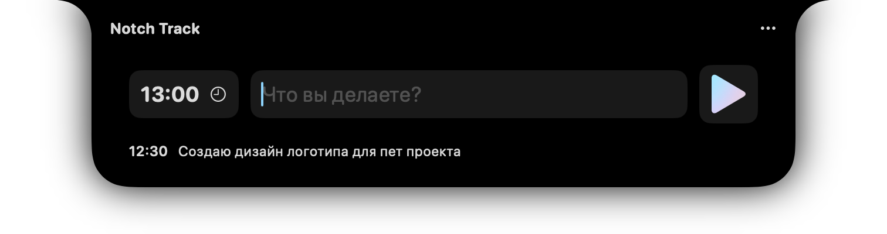

# NotchTrack

Приложение, которое позволяет использовать "вырез" на макбуках в качестве таймтрекера.

[English 🇺🇸](/README.md)

## 👀 Демонстрация

## 🌟 Ключевые функции

- [x] Совместимо с другими менеджерами строки меню
- [x] Собирает ваши логи времени в любую указанную папку (даже с git репозиторием), разбивая логи по дням.
- [x] Логи сохраняются в формате Yaml. Вы можете легко обрабатывать их в удобном вам инструменте.
- [x] Полностью с открытым исходным кодом и ориентированное на конфиденциальность
- [x] Полностью бесплатно

## 🚀 Использование

Вы можете скачать последнюю версию на странице [Релизов](https://github.com/rlshukhov/NotchTrack/releases).

Или собрать самостоятельно из исходников (необходим только XCode)

## 🧑‍⚖️ Лицензия

[MIT License](/LICENSE)

## 🥰 Благодарности

Спасибо проекту [NotchDrop](https://github.com/Lakr233/NotchDrop) который был использован в качестве базы для этого проекта.

---

Copyright © 2024 Lakr Aream, Lane Shukhov.